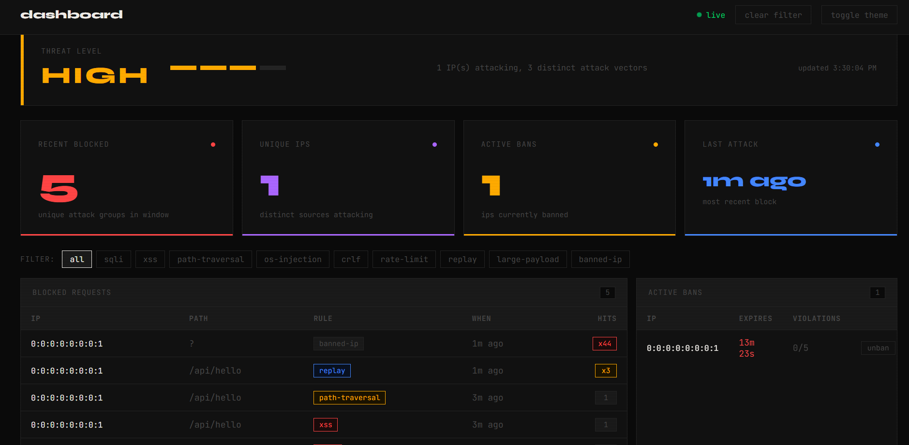

# WAF — Spring Boot Web Application Firewall

A plug-and-play WAF library for Spring Boot. Intercepts every inbound request through a multi-stage filter pipeline — inspecting, scoring, and enforcing security rules before traffic reaches your application. State is managed entirely in Redis.


---

## What it does

- Blocks SQL injection, XSS, path traversal, OS command injection, CRLF injection, and oversized payloads
- Enforces per-IP rate limiting with automatic violation tracking
- Detects and blocks replay attacks on state-changing requests (POST, PUT, DELETE, PATCH)
- Auto-bans IPs that exceed a violation threshold, with configurable ban duration
- Caches verdicts in Redis to avoid redundant rule evaluation
- Provides a live dashboard at `/waf/admin/dashboard` and a REST admin API

---

## Requirements

- Java 17+, Spring Boot 4.0.x
- A running Redis instance

---

## Installation

```xml
<repositories>
    <repository>
        <id>jitpack.io</id>
        <url>https://jitpack.io</url>
    </repository>
</repositories>

<dependency>
    <groupId>com.github.RiddhikaR</groupId>
    <artifactId>waf</artifactId>
    <version>v1.0.0</version>
</dependency>
```

The filter registers automatically via component scanning. No additional setup required.

---

## Configuration

```yaml
waf:
  rate-limit:
    threshold: 50              # requests per IP per window (default: 50)
    window-seconds: 60         # window duration in seconds (default: 60)

  ban:
    max-violations: 5          # violations before ban (default: 5)
    violation-window-minutes: 5
    ban-duration-minutes: 15

  engine:
    verdict-ttl-minutes: 5     # how long to cache rule verdicts
    replay-ttl-seconds: 30     # replay detection window
    max-payload-length: 10000  # max request body in bytes
```

---
## Dashboard



## How It Works

- Incoming requests are checked against active IP bans and the rate limit before the body is read — early rejection keeps overhead minimal
- If both pass, the request body is buffered so it can be read across multiple stages without stream exhaustion
- The request is normalized and extracted into a structured object covering IP, method, path, query, headers, body, and a SHA-based hash
- The rule engine evaluates sequentially — SQL injection, XSS, path traversal, OS command injection, CRLF, large payload — stopping at the first match
- Verdicts are cached in Redis; repeat requests skip re-evaluation entirely
- Every block records a violation against the source IP; once violations exceed the configured threshold, the IP is banned automatically for the configured duration

---

## License

MIT
